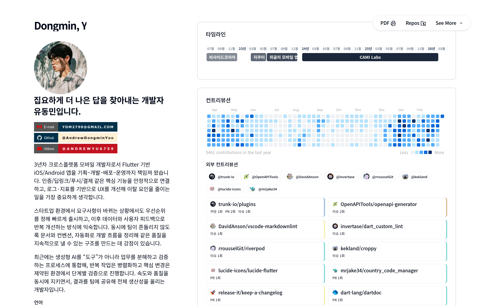
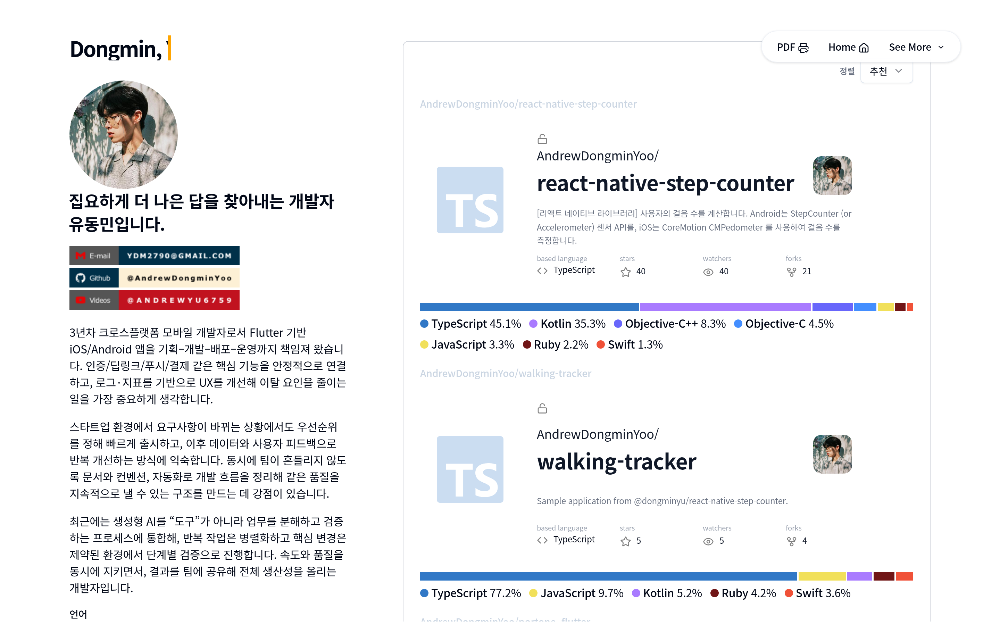
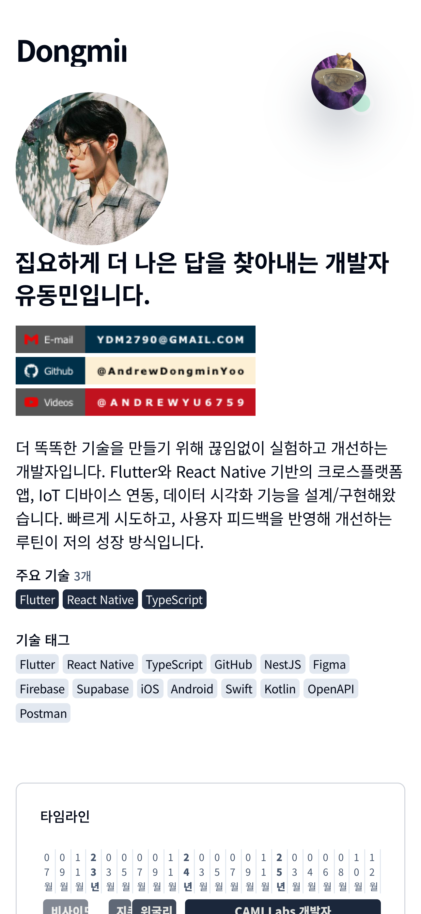
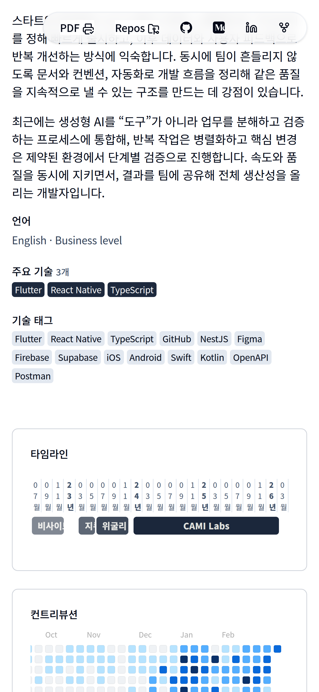
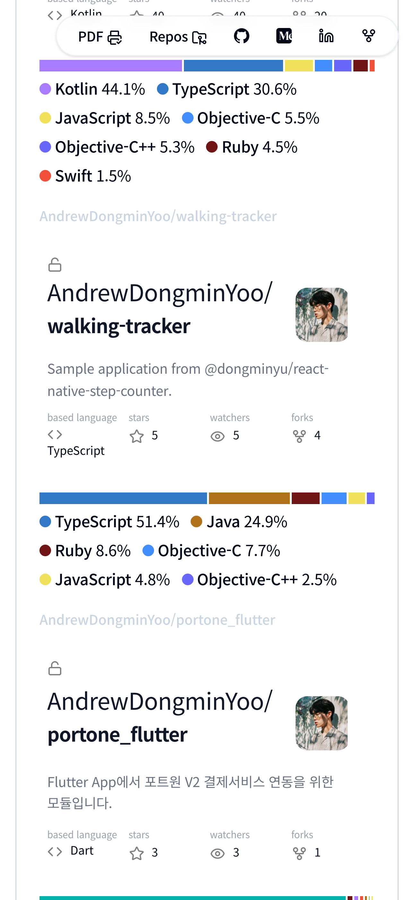

# My Public Resume and Portfolio Website

## Preview (Desktop)





## Preview (Mobile)

|  |  |  |
| ------------------------------------- | ------------------------------------- | ------------------------------------- |

## YOO DONG MIN :: WHO I AM

I am a former chef who decided to pursue a career in development during the COVID-19 pandemic. I started teaching myself web scraping using Python and later picked up React Native. I then completed a national support program for Java Spring development and became a backend developer. I also worked on Flutter applications before landing a job as a React Native developer. I really appreciate the productivity-focused and growth-oriented culture of the development industry, and I want to help beginners overcome their anxieties and uncertainties. I believe that there is a lot of room for growth in the mobile app industry, and I am excited to continue my journey as a developer.

저는 전직 요리사였으며 코로나19 팬데믹에 의한 실업급여 기간 동안 개발에 빠져 이 분야에서 경력을 쌓기로 결심했습니다. 파이썬을 사용하여 웹 스크래핑을 스스로 배우기 시작했고 나중에 React Native를 선택했습니다. 그 후 Java Spring 개발을 위한 국가 지원 프로그램을 수료하고 백엔드 개발자가 되었습니다. 첫 업무는 Django 백엔드 개발자로 시작했지만, 좋은 기회로 Flutter 애플리케이션 개발을 하게 되었으며, 현재는 리액트 네이티브 개발자로 일하고 있습니다. 저는 생산성 중심적이고 성장 지향적인 개발 업계의 문화를 정말 좋아하며, 과거의 저와 같은 입문자들이 불안과 불확실성을 극복할 수 있도록 돕고 싶습니다. 모바일 앱 업계에는 성장의 여지가 많다고 생각하며, 개발자로서의 여정을 계속 이어갈 수 있게 되어 기쁩니다.

## ABOUT THIS PROJECT

After completing a backend development training course and looking for a job, I saw a lot of developer blogs and awesome resumes publicly posted by other developers, so I decided I wanted to do a project that could be both a resume and a personal portfolio, so I started with a static HTML+CSS+JS GitHub page, migrated to Next.js, which I'm very interested in, and now have a printable resume page that's SEO optimized and has a lot of fun dynamic elements. I currently have a github.io page redirecting to this site, but I plan to merge the projects into a personal domain.

백엔드 개발 교육 과정을 마치고 일자리를 찾던 중 다른 개발자들이 공개적으로 올린 개발자 블로그와 멋진 이력서를 많이 보고 이력서와 개인 포트폴리오를 겸할 수 있는 프로젝트를 해보고 싶다는 생각이 들어 정적인 HTML+CSS+JS 깃허브 페이지로 시작해서 제가 관심이 많은 Next.js로 마이그레이션한 후 SEO에 최적화되고 재미있는 동적 요소가 많이 포함된 인쇄 가능한 이력서 페이지를 만들게 되었어요. 현재 이 사이트로 리디렉션되는 github.io 페이지가 있지만 프로젝트를 개인 도메인으로 병합할 계획입니다.

## 프로젝트 폴더 구조

- `src/app/`: App Router 페이지와 API 라우트
- `src/components/`: 공통 UI 컴포넌트
- `src/features/`: 도메인별 기능 단위 컴포넌트
- `src/interface/`: 타입/인터페이스 정의
- `src/lib/`: 공통 유틸리티/헬퍼
- `data/`: 정적 데이터 (posts, repos)
- `public/`: 정적 파일 (이미지, 폰트, resume PDF 등)
- `assets/`: README용 프리뷰 이미지
- `scripts/`: 자동화 스크립트 (preview 캡처 등)

## 실행 방법

클론 아래 코드 중 하나를 실행합니다.

```shell
git clone https://github.com/AndrewDongminYoo/portfolio.git resume
git clone git@github.com:AndrewDongminYoo/portfolio.git resume
gh repo clone AndrewDongminYoo/portfolio resume

cd resume
```

환경 변수 설정

```shell
cp .env.sample .env
```

```log
GITHUB_TOKEN="깃허브 토큰 입력" (리포지토리 조회 권한 포함)
PREVIEW_BASE_URL="프리뷰 캡처 기준 URL" (예: http://localhost:3000)
```

실행하는 방법

```shell
cd resume
yarn install
yarn dev
```

기타 스크립트는 package.json에 모두 작성되어 있으므로 생략합니다.

## Preview 이미지 자동화

새로운 배포가 완료될 때마다 로컬/원격 URL을 기반으로 README용 Preview 이미지를 자동으로 캡처할 수 있습니다.

1. `.env` 혹은 실행 시 인자로 `PREVIEW_BASE_URL`(예: `https://andrew.vercel.app`)을 지정합니다.
2. 필요하면 `scripts/preview-targets.json`에서 캡처할 뷰포트/스크롤/타깃 경로를 수정합니다.
3. `yarn update:png` 명령으로 `assets/*.png` 파일을 재생성합니다. 특정 항목만 갱신하려면 `yarn update:png -- --target mobile-1.png` 형태로 이름을 지정할 수 있습니다.

스크립트는 Puppeteer를 사용하므로 최초 실행 시 브라우저 바이너리를 다운로드합니다. `assets/` 폴더에 생성된 결과를 커밋하면 README에 최신 화면이 반영됩니다.

## 최신 이력서 PDF 다운로드

`/api/resume` 엔드포인트에 접속하면 가장 최근에 업로드된 A4 사이즈 PDF를 즉시 다운로드할 수 있습니다.

- 새 버전을 배포하려면 `public/resume/` 폴더에 PDF 파일을 추가(혹은 교체)하면 됩니다. 파일명과 개수는 자유롭지만, 수정 시간(mtime)이 가장 최근인 파일이 자동으로 선택됩니다.
- Next.js Route Handler가 `Content-Disposition: attachment` 헤더를 내려주므로 브라우저나 `curl -L https://andrewdongminyoo.vercel.app/api/resume -o resume.pdf` 명령으로 쉽게 받을 수 있습니다.

리포지토리에는 기본 플레이스홀더 PDF(`public/resume/집요하게 더 나은 답을 찾아내는 개발자 유동민입니다_.pdf`)가 포함돼 있으므로 실제 최신 버전으로 교체해 주세요.
